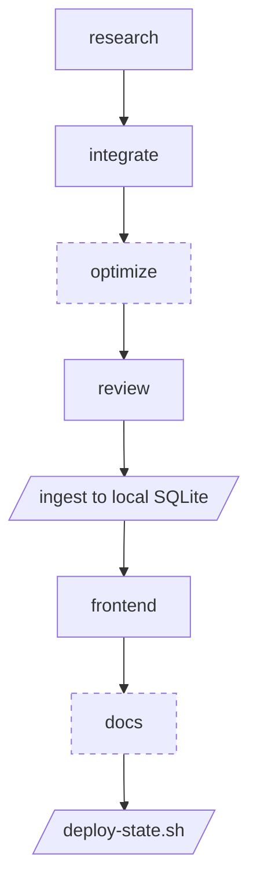

# ScratchROI

ScratchROI is a website that provides a calculated "return on investment" value for lottery scratchers.

The site is updated nightly, and free.

Most of the state integrations were not directly written by me, but written by agents created by me.

An agent pipeline researches each state's data source then writes the scraper and the parser according to my specs. Another agent then validates the output against my guidelines, and refuses to ship a state that fails. This write up is mostly about that pipeline.

**Built with**

- **Agents** — Claude Agent SDK, Opus / Sonnet / Haiku, PostToolUse and Stop hooks for gating
- **Scraping** — Python, Playwright
- **Orchestration** — self hosted n8n on a VPS
- **Data** — SQLite, FastAPI read only API
- **Site** — Astro, React, Vercel

## What it does

For every active game in a supported state, I calculate expected value and return on investment per game using the state's own published prize data. This is recalculated nightly as each state publishes how many prizes have been claimed on each game. At the same time, we pick up any new tickets that have been released and add them to the site listing.

This is critical to the value proposition of the site, as a game that was worth buying at launch is worth less once the top prizes are gone.

## Why I built it

I wanted to know which tickets were worth buying, if any. I wanted to compare a new ticket's value against a stale ticket. Lastly, to see if any ticket ever goes positive (it does not).

The ticket numbers are mostly public. Existing sites had already worked that out and were charging for it. ScratchSmarter sells reports on a subscription, and LottoEdge paywalls its rankings. Given this, I built this site and the tools to make the numbers free.

## How it works

A single word gets turned into a fully functional data scraping pipeline.

You start the agent workflow with a state value, "Florida" for example, and it begins by researching how that state displays its lottery scratcher data, and what options we have for collecting it.

If all required data points are found, it proceeds through each subsequent agent. Each agent will verify their own work until the state is "Live" on the site. The code is then integrated into the fully-automated daily pipeline.

A nightly, self-hosted N8N workflow runs the scrapers for each state. This updates the numbers in the database and triggers a redeploy of the site, which pulls the new numbers from the API at build time.

The states that show on the website, and the scrapers that run, are determined by config flags. These flags can be toggled on or off, allowing for greater control over the site contents.

### The schema

The calculation decides which fields are non-negotiable:

```
per prize tier:
  prizes_paid   = TotalPrizes - PrizesRemaining
  tickets_sold += prizes_paid * OverallOdds
  tickets_left  = TicketsPrinted - tickets_sold
  EV           += (PrizesRemaining / tickets_left) * PrizeAmount

ROI = (EV - Cost) / Cost
```

That comes to ten fields. Eight of them have to be found on the state's lottery site:

**Must be found** — GameId, GameName, Cost, OverallOdds, PrizeAmount, TotalPrizes, PrizesRemaining, ImageUrl

**Derived** — TicketsPrinted is total prizes times the overall odds. PrizesPaid is total minus remaining.

The last two are never worth hunting for. Knowing which fields have to be found, and which can be computed, is the difference between sending an agent after eight items and sending it after ten. The two that do not exist are what a blind agent will invent.

I wrote this list while building Washington by hand. Every state after Washington is a test of whether the list holds true.

TotalPrizes is the item that most often causes states to fail. It's the original count-per-tier, before anything was claimed. Plenty of states only publish what is left.

Without TotalPrizes you can't work out how many tickets have been sold. That is the number everything else divides by.

### The agent pipeline

I built these agents while working through the initial states. I ran each stage myself, reading and verifying what was returned before letting it move on. Most of that input went into the research agent, as the agent collects all the information that has to be accurate for future steps.

An agent turned loose on a lottery site with little or inaccurate direction will find something that looks like the answer and report it as found. This being the case, the prompt has to tell it where to look, what counts as proof and what it means to pass or fail.



Dashed stages are allowed to fail without stopping the run. Parallelograms are scripts run by the workflow, not agents.

**The contract between stages is a file**

Every stage declares its output paths before it starts. A Stop hook checks those paths when the agent tries to finish and refuses to let it stop while any are missing. If they are still missing when the run ends, the stage fails and the workflow halts.

Research and review add a second check on top, where the orchestrator reads a verdict out of the file and stops the run if the result is not a PASS.

**research**

- The only stage with internet access. Web search, web fetch and a Playwright browser.
- Writes an XML report that gets injected into the next agent's prompt. That report is the entire handoff.
- Eight fields have to be found and two more are derivable. Anything missing makes the verdict FAIL and the run stops there.

**integrate**

- Writes the scraper and the parser from that report.
- The **scraper** is the only part that knows anything about that state. It goes to whatever that state publishes, an API, a rendered page, an open data portal, and writes one JSON file in the same shape every state uses. Games, prize tiers, counts. No math.
- The **parser** reads that file, runs the EV and ROI math, and writes the file the site serves. All parsers import the same calculator. As a result, every state is computed identically and can be run and tested separately, if needed.
- Cannot finish until it has run both and every game has all eight fields.

**optimize**

- Gets the scraper under 90 seconds. Changes go in small batches, with a rerun after each batch to confirm the scraper still works and the change did what it was supposed to. Anything that breaks is rolled back from a backup.
- Game count is not allowed to drop. A faster scraper that returns less is a failure.
- The only stage allowed to fail. The run logs a warning and continues.

**review**

- Runs the scraper and parser itself and audits every game.
- ROI above 0 fails outright. In practice a positive number means a parsing error, not a winning ticket.
- Verdict has to be PASS or nothing goes further.

**ingest**

- Not an agent. Loads the parsed data into a local SQLite so the next stage has a real API to read from.

**frontend**

- Runs with that local API started around it, so it builds the page against real data instead of a fixture.
- Writes the state page and the per game page of our site.

**docs**

- Small agent that documents the entire workflow and is run after every workflow update.

**deploy-state.sh**

- Not an agent. Pushes the backend on its own commit, then triggers the scraper on the VPS and waits.
- Then checks whether the production API returns the state. That is how I find out if the datacenter IP is blocked, which is not something I can test locally.
- The frontend only gets pushed if the API answers. A failure re-runs the deploy with the state flagged as needing a proxy.

## What I would add

**Automatic Failure Correction**

The nightly run already writes a report on what every state returned. If any states errored the report is escalated to me.

I could replace myself in this process with an additional agent that automatically handles errors and determines if it's a one-off error or if the lottery site's structure has changed. In the former's case it means that state needs to be re-run. If it's the latter the new site's structure will need to initiate a new research pass.

## The result

I did one state by hand and mapped out my process and data structure. I broke out my workflow into stages that could be handled by agents. I then designed those agents to operate as I did and verify their work. Failure responses are human gated.

I then used this workflow to create the remaining state scrapers.

The final product is a pipeline that is able to take a single word "{State}" and output a fully functional scraper within the system I designed.

Live at [https://www.scratchroi.com/](https://www.scratchroi.com/)
